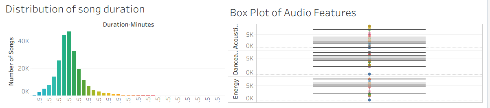

# 👋 Hi, I'm Naomi 

I’m a Junior Data Analyst / BI Analyst with a strong interest in customer insights, marketing analytics, and data-driven decision-making across healthcare, commercial, and digital environments.

---

## 🧠 About Me

I recently completed a Data Analysis Bootcamp, where I developed practical skills in analysing data, building dashboards, and communicating insights. I am currently showcasing a selection of my projects that demonstrate my learning and approach to real-world data problems.

Prior to this, I completed an AI Bootcamp, where I gained foundational knowledge in:

Machine Learning, Natural Language Processing (NLP), Computer Vision, Generative AI

This gave me a strong understanding of how data underpins modern systems, from chatbots to predictive models, and is what sparked my interest in pursuing a career in data analysis.

---

## 💼 Background & Experience

I have experience managing and working with data in fast-paced environments. Previously, I worked in the head office of a national builders’ merchant as a Print Administrator, where I:

Processed and costed print jobs across 500+ branches

Managed operational data and workflows

Liaised with internal teams to meet deadlines and design requirements

In addition, I have a background in care and therapy, which has strengthened my:

Attention to detail

Communication skills

Ability to work under pressure

Real-world problem-solving

I also explored entrepreneurship, which helped me develop a more commercial mindset and understand how businesses operate.

---

## 📊 Selected Portfolio Projects

## Excel - Data Analysis 

I worked on a sales data analysis project using a retail sales dataset in Excel, which included transactional data, such as customer ID, age, gender, product category, quantity, price per unit, total sales, and commission.

The aim of this project was to understand sales performance and identify patterns across different customer groups and product categories.

I started by organising the dataset into a structured table and using filters and sorting to explore the data. I then used formulas such as SUM and AVERAGE to calculate key metrics like total commission and average values.
I also used pivot tables to summarise the data and compare performance across categories, such as product type and customer demographics.”

[Used Excel to analyse sales data using pivot tables, formulas, and categorisation techniques to identify performance trends and insights.]

---

## Tableau - Music Trends & Popularity Analysis 

Analysed Spotify data to identify trends in genre popularity, song characteristics, and factors influencing track success.

This dashboard provides an overview of Spotify music features, focusing on popularity, genre distribution, and audio characteristics. It highlights relationships between popularity, danceability, and song duration, as well as identifying top-performing artists. Interactive elements allow users to explore how different genres influence overall music trends.

## Dashboard Preview - Visualisations

## Interactivity

- Users can click on genres to filter and explore how different categories influence popularity and audio features.
- The dashboard allows dynamic comparison between artists, song duration, and musical characteristics.

## Key Insights

- Pop, Rap, and Rock are the most popular genres, significantly outperforming others in overall popularity.
- There is a positive relationship between **danceability and popularity**, suggesting that more danceable tracks tend to achieve higher success.
- Most songs are clustered between **3–4 minutes**, indicating a standard duration for popular music.
- A small number of artists dominate the charts, with top performers like Drake achieving significantly higher popularity scores.
- Audio features such as energy, danceability, and acousticness show variation, but popular tracks tend to cluster around moderate to high energy levels.

Pop, Rap, and Rock are the most popular genres, significantly outperforming others in overall popularity.
There is a positive relationship between danceability and popularity, suggesting more danceable tracks tend to perform better.
Most songs cluster around 3–4 minutes, indicating a standard duration range for popular tracks.
Top artists (e.g., Drake) dominate in popularity, showing a concentration of success among a few key performers.
Audio features (energy, danceability, acousticness) vary widely, but popular tracks tend to cluster around moderate-to-high energy levels.

---

🔹 Customer Segmentation Analysis (Bike Sales Data)

Explored customer segments across markets, identifying key trends in profitability by age group, gender, and region.

---

🔹 Global Health Dashboard (Tableau)

Developed an interactive dashboard analysing global health trends such as life expectancy and BMI, with insights relevant to public health and healthcare systems.

---

---

🔹 Power BI Reports & Dashboards

Built reports and dashboards using Power BI, including data transformation and visualisation to support decision-making.

---

## 📫 Let’s Connect

LinkedIn: 

Email: 

